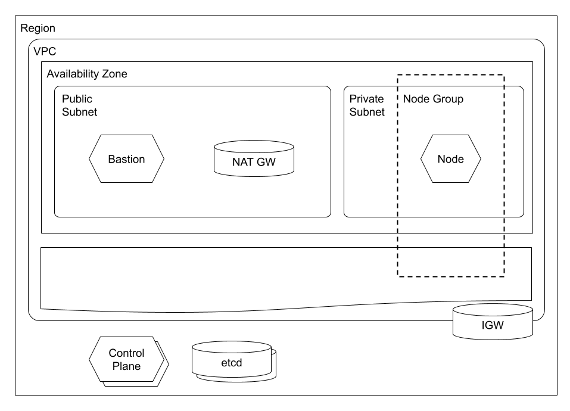

# Installation, Configuration & Validation: Design a Kubernetes Cluster

TODO: VIDEO

## Concepts

We start with a basic understanding of Kubernetes:

> Kubernetes is a portable, extensible, open-source platform for managing containerized workloads and services, that facilitates both declarative configuration and automation. It has a large, rapidly growing ecosystem. Kubernetes services, support, and tools are widely available.

*- Kubernetes - [What is Kubernetes?](https://kubernetes.io/docs/concepts/overview/what-is-kubernetes/)*

And then, Kubernetes Clusters, Nodes, and Control Planes:

> A Kubernetes cluster consists of a set of worker machines, called nodes, that run containerized applications. Every cluster has at least one worker node.
The worker node(s) host the Pods that are the components of the application workload. The control plane manages the worker nodes and the Pods in the cluster. In production environments, the control plane usually runs across multiple computers and a cluster usually runs multiple nodes, providing fault-tolerance and high availability.

*- Kubernetes - [Kubernetes Components](https://kubernetes.io/docs/concepts/overview/components/)*

In addition to Control Plane(s), Kubernetes clusters have etcd database(s):

> Consistent and highly-available key value store used as Kubernetes' backing store for all cluster data.

*- Kubernetes - [Kubernetes Components](https://kubernetes.io/docs/concepts/overview/components/)*

Kubernetes supports a range of Cluster topologies, including two high availability options:

- Single Node with etcd, Control Plane, and Worker

- Single Node with etcd and Control Plane; multiple Worker Nodes

- (High Availability-Stacked etdc) Multiple Nodes with etcd and Control Plane; multiple Worker Nodes

- (High Availability-External etcd) Multiple etcd hosts, multiple Control Plane Nodes; multiple Worker Nodes

Before we create our Kubernetes Cluster, we need to create a network:

> Public and private subnets - This VPC has two public and two private subnets. One public and one private subnet are deployed to the same Availability Zone. The other public and private subnets are deployed to a second Availability Zone in the same Region. We recommend this option for all production deployments. This option allows you to deploy your worker nodes to private subnets and allows Kubernetes to deploy load balancers to the public subnets that can load balance traffic to pods running on worker nodes in the private subnets.

*- AWS - [Creating a VPC for your Amazon EKS cluster](https://docs.aws.amazon.com/eks/latest/userguide/create-public-private-vpc.html)*

One benefit of using EKS is that it uses the High Availability-External etcd cluster topology and supports the public / private network configuration:

## Steps

1. Follow instructions, [Getting started with Amazon EKS](https://docs.aws.amazon.com/eks/latest/userguide/getting-started.html), to install a Kubernetes cluster

**note**: At the time of this writing, the *eksctl* CLI tool had an issue that prevented me from using it.

**note**: While I did install the Kubernetes cluster using the AWS Management Console, I replicated the resultant cluster configuration in a Terraform configuration.
