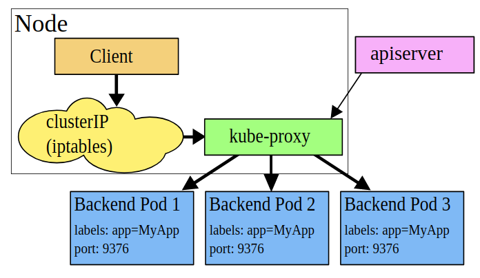
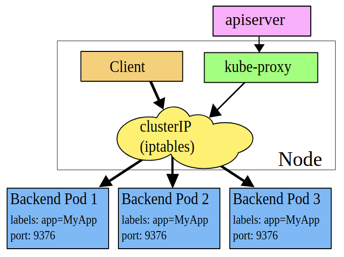

# Core Concepts: Understand Services and other Network Primitives

Back to [Certified Kubernetes Administrator (CKA) Tutorial](https://github.com/larkintuckerllc/k8s-cka-tutorial)

**note:** Includes the following additional topics:

* Networking: Understand Service Networking

* Networking: Understand CNI

**Addendum**: There is an imperative CLI way to create a service that I did not address, e.g., the following will create that YAML for the service.

```plaintext
kubectl expose deployment/example-dev --dry-run -o yaml
```

[](https://youtu.be/NUTuloFZo2Y)

## Script

### Cluster IP Example (with Selectors)

> Kubernetes Pods are mortal. They are born and when they die, they are not resurrected. If you use a Deployment to run your app, it can create and destroy Pods dynamically.
> Each Pod gets its own IP address, however in a Deployment, the set of Pods running in one moment in time could be different from the set of Pods running that application a moment later.
> This leads to a problem: if some set of Pods (call them “backends”) provides functionality to other Pods (call them “frontends”) inside your cluster, how do the frontends find out and keep track of which IP address to connect to, so that the frontend can use the backend part of the workload?
> Enter Services

*-Kubernetes-[Service](https://kubernetes.io/docs/concepts/services-networking/service/)*

Install service and inspect:

Notice IP, ClusterIP, port, targetPort, and Endpoint

```plaintext
helm install dev service-selectors

kubectl get all

kubectl describe service example-dev

kubectl get service example-dev -o yaml
```

Side notes:

> A Service can map any incoming port to a targetPort. By default and for convenience, the targetPort is set to the same value as the port field.

and

> For some Services, you need to expose more than one port. Kubernetes lets you configure multiple port definitions on a Service object. When using multiple ports for a Service, you must give all of your ports names so that these are unambiguous.

*-Kubernetes-[Service](https://kubernetes.io/docs/concepts/services-networking/service/)*

Login to ubuntu Pod, update, install:

```plaintext
kubectl exec example-dev -it -- bash

apt-get update
apt-get install dnsutils -y
apt-get install curl -y
```

Discover services:

```plaintext
printenv

cat /etc/resolv.conf

nslookup example-dev.default

curl example-dev.default
```

**note**: Noticed that *curl* did not properly handle *curl example-dev*

### Cluster IP Example (without Selectors)

> Services most commonly abstract access to Kubernetes Pods, but they can also abstract other kinds of backends. For example:

* You want to have an external database cluster in production, but in your test environment you use your own databases.

* You want to point your Service to a Service in a different Namespace or on another cluster.

* You are migrating a workload to Kubernetes. Whilst evaluating the approach, you run only a proportion of your backends in Kubernetes.

*-Kubernetes-[Service](https://kubernetes.io/docs/concepts/services-networking/service/)*

```plaintext
helm install dev service-no-selectors
```

### Behind the Scenes

So how is traffic getting to the service IP address?

> Every node in a Kubernetes cluster runs a kube-proxy. kube-proxy is responsible for implementing a form of virtual IP for Services of type other than ExternalName.

*-Kubernetes-[Service](https://kubernetes.io/docs/concepts/services-networking/service/)*

There are three ways a Cluster can be configured: User Space Proxy Mode, iptables Proxy Mode, and IPVS proxy mode.

#### User Space Proxy Mode

> In this mode, kube-proxy watches the Kubernetes master for the addition and removal of Service and Endpoint objects. For each Service it opens a port (randomly chosen) on the local node. Any connections to this “proxy port” are proxied to one of the Service’s backend Pods (as reported via Endpoints). kube-proxy takes the SessionAffinity setting of the Service into account when deciding which backend Pod to use.
> Lastly, the user-space proxy installs iptables rules which capture traffic to the Service’s clusterIP (which is virtual) and port. The rules redirect that traffic to the proxy port which proxies the backend Pod.



*-Kubernetes-[Service](https://kubernetes.io/docs/concepts/services-networking/service/)*

#### iptables Proxy Mode

> In this mode, kube-proxy watches the Kubernetes control plane for the addition and removal of Service and Endpoint objects. For each Service, it installs iptables rules, which capture traffic to the Service’s clusterIP and port, and redirect that traffic to one of the Service’s backend sets. For each Endpoint object, it installs iptables rules which select a backend Pod.



*-Kubernetes-[Service](https://kubernetes.io/docs/concepts/services-networking/service/)*

#### IPVS Proxy Mode

> In ipvs mode, kube-proxy watches Kubernetes Services and Endpoints, calls netlink interface to create IPVS rules accordingly and synchronizes IPVS rules with Kubernetes Services and Endpoints periodically. This control loop ensures that IPVS status matches the desired state. When accessing a Service, IPVS directs traffic to one of the backend Pods.

*-Kubernetes-[Service](https://kubernetes.io/docs/concepts/services-networking/service/)*

This is a high-performance feature that we will not address in this series; there is an article on it at [IPVS-Based In-Cluster Load Balancing Deep Dive](https://kubernetes.io/blog/2018/07/09/ipvs-based-in-cluster-load-balancing-deep-dive/).

#### AWS Implementation

After a bit of digging, we can see that AWS indeed is using iptables mode for Service networking:

```plaintext
kubectl describe daemonset kube-proxy -n kube-system

kubectl describe cm kube-proxy-config -n kube-system
```

**note:** IPVS is apparently not currently supported in EKS; but looks like some folks have gotten it to work.

While we talked about it before, wanted to remind ourselves that Pod Networking is handled separately using a CNI Plugin.

> Amazon EKS supports native VPC networking via the Amazon VPC Container Network Interface (CNI) plugin for Kubernetes. Using this CNI plugin allows Kubernetes pods to have the same IP address inside the pod as they do on the VPC network.

*-Kubernetes-[Pod networking (CNI)](https://docs.aws.amazon.com/eks/latest/userguide/pod-networking.html)*
